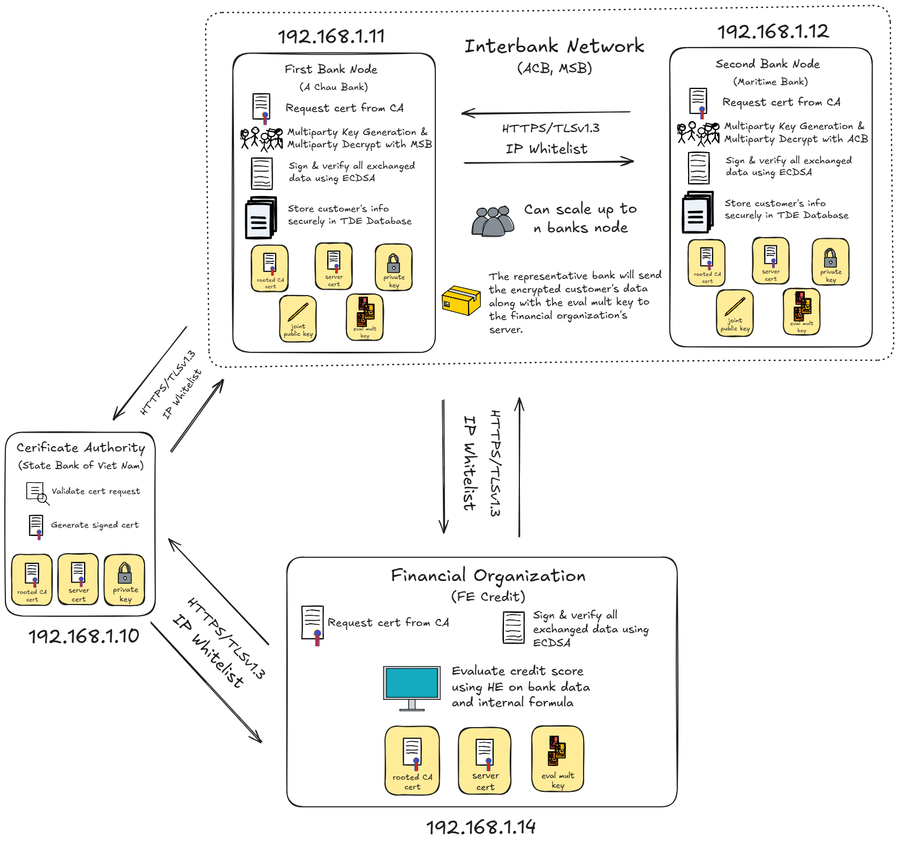

# HỆ THỐNG ĐÁNH GIÁ ĐIỂM TÍN DỤNG LIÊN NGÂN HÀNG & TỔ CHỨC TÀI CHÍNH ỨNG DỤNG HOMOMORPHIC ENCRYPTION

## MÔ TẢ DỰ ÁN

Hệ thống tính toán điểm tín dụng bảo mật sử dụng Multiparty CKKS cho phép nhiều bên cùng nhau hợp tác
để tính toán trên dữ liệu đã mã hóa mà không cần giải mã, đảm bảo tính riêng tư và bảo mật dữ liệu tuyệt đối.

## DEMO HỆ THỐNG

[](https://www.youtube.com/watch?v=zf33MT_4sFw)

## KIẾN TRÚC HỆ THỐNG



## CẤU TRÚC THƯ MỤC

```
NT219_Project/
├── CA/                               # Certificate Authority (Ngân hàng Nhà Nước)
│   ├── server.py                     # CA server (FastAPI)
│   ├── rootCA.crt                    # Root certificate
│   └── runServer.sh                  # Startup script
│
├── Banks/                            # Ngân hàng (MSB, ACB)
│   ├── HEModule/                     # Homomorphic Encryption
│   │   ├── interactiveEncrypt.py
│   │   ├── keyGenerator.py
│   │   ├── calculateJointKey.py
│   │   ├── evalMultKey1.py
│   │   ├── evalMultKey2.py
│   │   ├── multipartyDecrypt.py
│   │   └── MainWindow.ui
│   ├── InterbankService/            # API giao tiếp liên ngân hàng
│   │   ├── interbankAPI.py
│   │   ├── interbankClient.py
│   │   └── sendToFECredit.py
│   ├── Certificate/                 # Quản lý chứng chỉ
│   │   └── requestCert.py
│   └── DBService/                   # Dịch vụ cơ sở dữ liệu
│       └── getCustomerInfo.py
│
├── FinanceOrg/                       # Tổ chức tài chính (FE Credit)
│   ├── HEServer.py                   # Server tính điểm tín dụng
│   └── Certificate/
│       └── requestCert.py
│
├── Testing/                          # Testing và Benchmark
│   ├── PoC.py                        # Proof of Concept
│   ├── PoC_benchmark.py              # Performance testing
│   └── benchmark_results/
│
├── requirements.txt                  # Dependencies chính
└── README.txt                        # File này
```

---

## CÀI ĐẶT

### 1. Yêu cầu hệ thống:

- Python 3.12
- 4 máy ảo/thật với network isolation
- Ubuntu 24.04 (không được là Windows, vì openfhe-python không chạy được trên đó)

### 2. Xem các hướng dẫn kèm theo repo

- [Setup Client](Setup%20Client.txt)
- [Cài PostgreSQL hỗ trợ TDE](Setup%20Postgres%20TDE%20trên%20Ubuntu.txt)

---

## QUY TRÌNH HOẠT ĐỘNG

### 1. TẠO CHỨNG CHỈ:

- Banks và FinanceOrg gửi yêu cầu đến CA
- CA ký và trả lại certificate

### 2. TẠO KHÓA FHE:

- Các ngân hàng phối hợp tạo khóa CKKS (public chung, private riêng)
- Sinh các evaluation key phục vụ tính toán

### 3. LƯU TRỮ DỮ LIỆU:

- Lưu tại PostgreSQL đã bật TDE
- Đảm bảo dữ liệu được mã hóa trên ổ đĩa

### 4. MÃ HÓA DỮ LIỆU:

- Trích xuất dữ liệu từ DB, mã hóa bằng Multiparty CKKS
- Gửi ciphertext + chữ ký số

### 5. TÍNH TOÁN ĐIỂM TÍN DỤNG:

- Tổ chức tín dụng nhận dữ liệu mã hóa
- Tính toán điểm số trực tiếp bằng FHE
- Gửi lại kết quả (mã hóa) + chữ ký số

### 6. GIẢI MÃ KẾT QUẢ:

- Kiểm tra chữ ký, xác minh tính toàn vẹn
- Các ngân hàng phối hợp giải mã kết quả

---

## BẢO MẬT HỆ THỐNG

### 1. Mã hóa:

- Multiparty CKKS (FHE) cho tính toán bảo mật
- ECDSA cho chữ ký số
- HTTPS/TLSv1.3 cho truyền tải
- PostgreSQL TDE cho dữ liệu at-rest

### 2. Xác thực & quyền truy cập:

- Xác thực dựa trên chứng chỉ (Certificate-based Auth)
- Whitelist IP
- Kiểm tra chữ ký số, phân quyền truy cập DB

### 3. Bảo vệ dữ liệu:

- Dữ liệu luôn ở dạng mã hóa khi xử lý & lưu trữ
- Không giải mã tại server trung gian
- Multi-party decryption đảm bảo không ai đơn lẻ giải mã được
